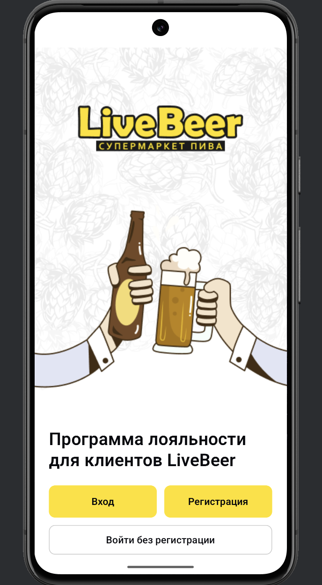
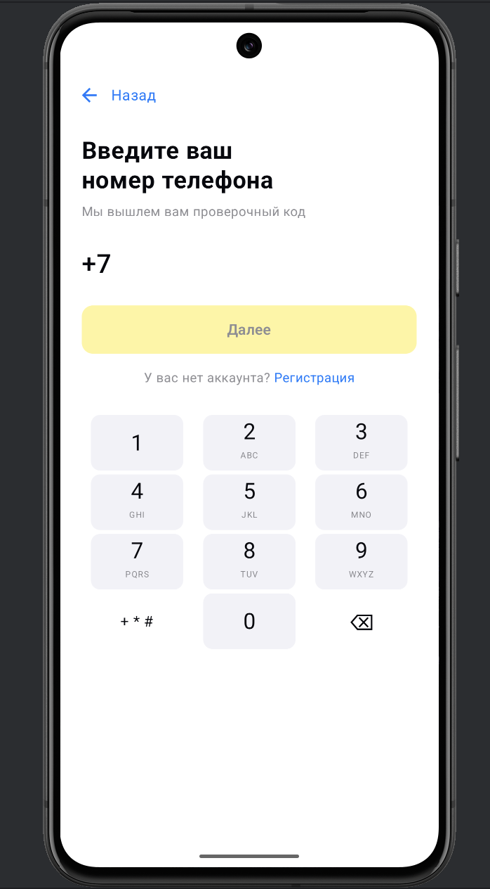
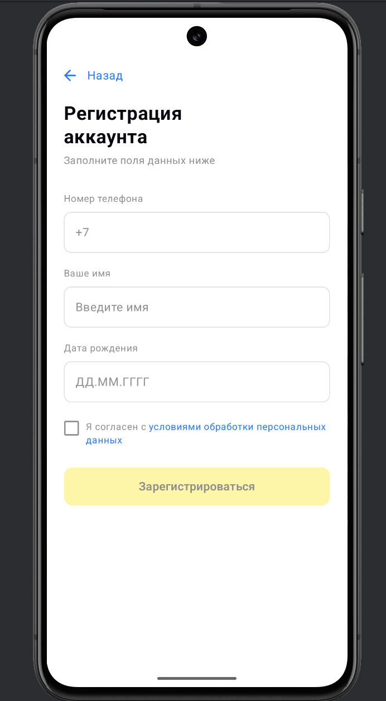
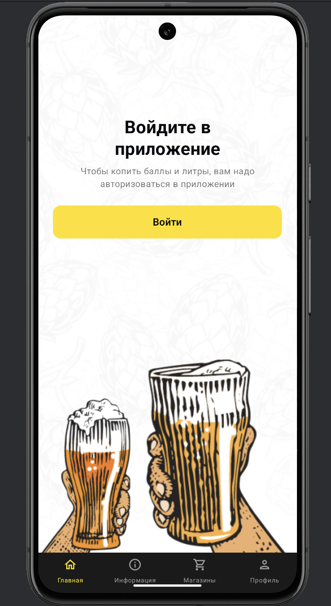

<p align="center">
  
  
  
  
</p>

# LiveBeer — Тестовое задание (Jetpack Compose)

Тестовое задание: сверстать несколько экранов мобильного приложения по предоставленным макетам.  
Все экраны реализованы на **Jetpack Compose** с акцентом на точное соответствие дизайну: типографика, отступы, цвета, поведение элементов и кастомные компоненты.

---

## 📱 Реализованные экраны

### Welcome Screen
Экран приветствия с большим изображением и тремя кнопками:

- Вход
- Регистрация
- Войти без регистрации

Особенности: полноэкранная иллюстрация, кастомные цвета и типографика, навигация через callback-и.

---

### Login Screen
Экран ввода номера телефона.

Функциональность:

- форматирование номера в реальном времени: `+7 (XXX) XXX XX XX`
- кастомная цифровая клавиатура в стиле iOS
- валидация номера
- имитация запроса на сервер
- отображение ошибок
- ссылка на регистрацию

---

### Register Screen
Экран регистрации нового пользователя.

Поля:

- номер телефона
- имя
- дата рождения (через `DatePickerDialog`)
- чекбокс согласия

Функциональность: валидация, отображение ошибок, форматирование даты, активация кнопки только при валидной форме.

---

### Code Screen
Экран ввода 4‑значного кода активации.

Функциональность:

- 4 кастомные ячейки ввода (точка / цифра / ошибка)
- таймер обратного отсчёта (47 секунд)
- повторная отправка кода
- кастомная цифровая клавиатура
- имитация проверки кода

---

### Main Screen (Unauthorized)
Экран для неавторизованного пользователя.

Содержит:

- белый контентный блок с фоновыми иллюстрациями
- заголовок и подзаголовок
- кнопку «Войти»
- кастомный нижний навбар

---

## 🧭 Навигация

Навигация реализована через `NavHost`.

Маршруты:

- `welcome`
- `login`
- `register`
- `code`
- `main_unauth`

Каждый экран получает только необходимые callback-и.

---

## 🎨 Тема и стили

Используется кастомная тема `LiveBeerTheme`.

В `MainActivity`:

- прозрачный статус-бар
- тёмный navigation bar
- корневой `Surface` с `fillMaxSize()`

---

## 🛠 Технологии

- Kotlin
- Jetpack Compose
- Material 3
- Navigation Compose
- DatePicker (Material3)
- Custom UI components
- `remember` для управления состоянием

---

## 📂 Структура проекта

```text
feature/
 ├── welcome/
 ├── auth/
 │    ├── login/
 │    ├── register/
 │    └── code/
 └── main/
core/
 └── ui/theme/
navigation/
 └── AppNavHost.kt
MainActivity.kt
